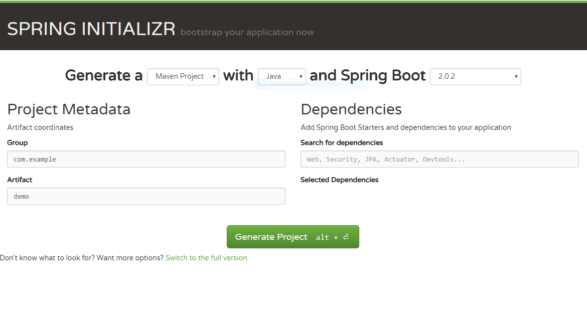
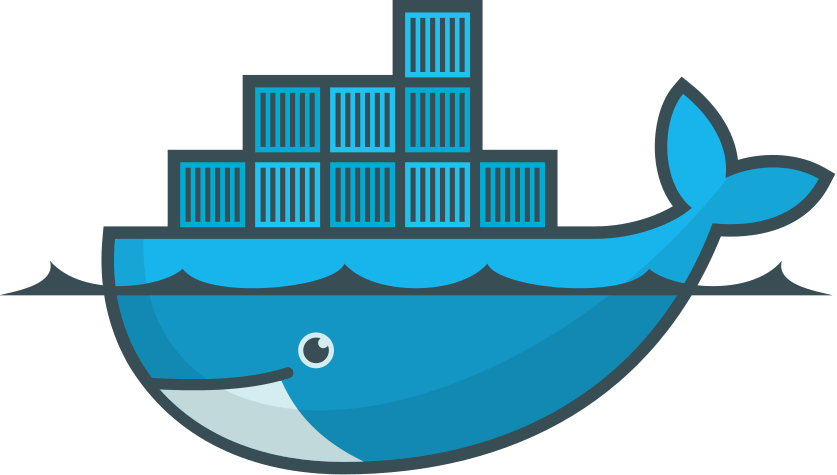
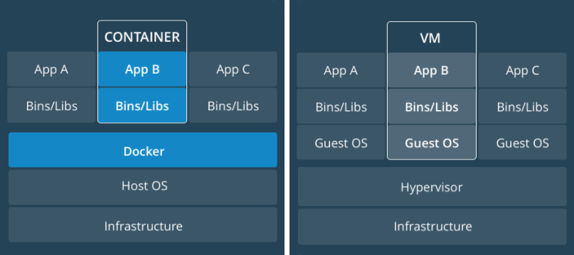

# Spring & Docker Workshop

### What is Spring and how to use Docker?

<small>Created by Daniel Pollack</small>

---

# Spring 

--

### Was ist Spring?

- Application Framework
- bringt IoC (Inversion of Control)
- bringt Dependency Injection

--

### Was mach Spring beim Start?

TODO

--

### [Spring Ökosystem](https://spring.io/projects)
- Spring ist modular
- alle Projekte sollten miteinander funktionieren

---

# Spring-Boot

--

### Was ist Spring-Boot?
>"Takes an <strong>opinionated</strong> view of building production-ready Spring applications. Spring Boot favors <strong>convention over configuration</strong> and is designed to get you up and running as quickly as possible."
<small>[https://projects.spring.io/spring-boot/](https://projects.spring.io/spring-boot/)</small>

--
<!-- .slide: style="text-align: left;" -->

### Features
- stand-alone Spring applications<!-- .element: class="fragment fade-up" -->
- embedded Tomcat (keine WAR files nötig)<!-- .element: class="fragment fade-up" -->
- 
stellt <strong>opinionated 'starter' POMs</strong> um Maven Konfiguration zu vereinfachen
<!-- .element: class="fragment fade-up" -->
- konfiguriert Spring automatisch, wann immer möglich<!-- .element: class="fragment fade-up" -->
- stellt "production ready" Features wie Metrics, Health Checks und externe Konfiguration<!-- .element: class="fragment fade-up" -->
- keine XML Konfiguration oder Code-Generierung notwendig<!-- .element: class="fragment fade-up" -->

<small>https://projects.spring.io/spring-boot/</small>

--

<!-- .slide: style="text-align: left;" -->

### Wie baue ich eine Spring-Boot-Anwendung von <b>0</b> auf?
- [https://start.spring.io](https://start.spring.io)
  

--
<!-- .slide: style="text-align: left;" -->

TASK

Erstellt eine Spring-Boot Anwendung

- Maven
- Java8
- Dependencies:
  - Web
---

# Testing Spring-Boot

---

# Docker

--

### Was ist Docker?

--

<!-- .slide: data-background="resources/images/works_on_dev.png" data-background-size="auto 100%" -->

--

### Container VS. VM

--

<!-- .slide: style="text-align: left;" -->

TASK

`$ docker run hello-world`

`$ docker run -p 8080:80 nginx`<!-- .element: class="fragment fade-up" -->

--
<!-- .slide: style="text-align: left;" -->
### Begriffe
#### Image & Layer

 > "A Docker image is built up from a series of layers. Each layer represents an instruction in the image’s Dockerfile. Each layer except the very last one is read-only."

<small>https://docs.docker.com/engine/userguide/storagedriver/imagesandcontainers/</small>

--
<!-- .slide: style="text-align: left;" -->
### Begriffe
#### Registry

 > "A registry is a storage and content delivery system, holding named Docker images, available in different tagged versions."

<small>https://docs.docker.com/registry/introduction/</small>
--
<!-- .slide: style="text-align: left;" -->
### Begriffe
#### Container

> "The major difference between a container and an image is the top writable layer."

<small>https://docs.docker.com/engine/userguide/storagedriver/imagesandcontainers/#container-and-layers</small>

--

<!-- .slide: style="text-align: left;" -->
### Begriffe
#### Docker Compose:
- Tool zum definieren und ausführen von Multi-Container Definitionen

#### Docker Machine:
- Docker Host auf mehren Plattformen starten

#### Docker Hub:
- Dockers registry für Images

--

### Was macht Docker beim Start?

todo

--

### Wie setze ich von 0 an eine Dockerumgebung auf?

--

### Wie verpacke ich meine Anwendung in Docker?

--
<!-- .slide: style="text-align: left;" -->

TASK

- erstellt ein `Dockerfile` und verpackt eure App

--

### Docker best practices

--

### Java in Docker

---

# Træfik 

--

## Was ist Træfik?

--

- HTTP reverse Proxy
- Loadbalancer
- unterstützt Dock

--

<!-- .slide: style="text-align: left;" -->

TASK

- ladet Træfik: `docker pull traefik`
- erweitert euer docker-compose file

_Powershell TIP_
`$Env:COMPOSE_CONVERT_WINDOWS_PATHS=1`
